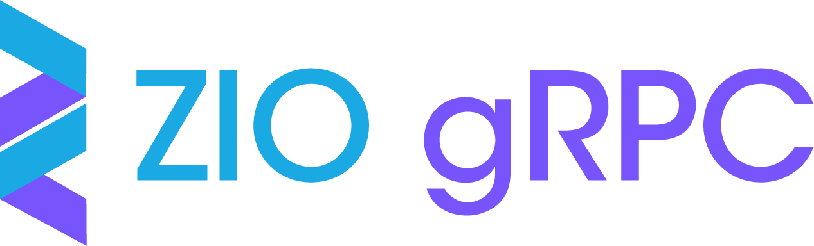

[![Snapshot Artifacts][Badge-SonatypeSnapshots]][Link-SonatypeSnapshots]

# Welcome to ZIO-gRPC

This library enables you to write purely functional [gRPC](https://grpc.io/) services using [ZIO](https://zio.dev).

## Documentation

* [ZIO gRPC homepage](https://scalapb.github.io/zio-grpc)

## Highlights

* Supports all types of RPCs (unary, client streaming, server streaming, bidirectional).
* Uses ZIO's `Stream` to let you easily implement streaming requests.
* Cancellable RPCs: client-side ZIO interruptions are propagated to the server to abort the request and save resources.

## Installation

Find the latest snapshot in [here](https://oss.sonatype.org/content/repositories/snapshots/com/thesamet/scalapb/zio-grpc/zio-grpc-core_2.13/).

Add the following to your `project/plugins.sbt`:

    val zioGrpcVersion = "0.4.0-RC2"

    addSbtPlugin("com.thesamet" % "sbt-protoc" % "0.99.34")

    libraryDependencies += "com.thesamet.scalapb.zio-grpc" %% "zio-grpc-codegen" % zioGrpcVersion
Add the following to your `build.sbt`:

    val grpcVersion = "1.30.2"
    
    PB.targets in Compile := Seq(
        scalapb.gen(grpc = true) -> (sourceManaged in Compile).value,
        scalapb.zio_grpc.ZioCodeGenerator -> (sourceManaged in Compile).value,
    )

    libraryDependencies ++= Seq(
        "com.thesamet.scalapb" %% "scalapb-runtime-grpc" % scalapb.compiler.Version.scalapbVersion,
        "io.grpc" % "grpc-netty" % grpcVersion
    )

## Usage

Place your service proto files in `src/main/protobuf`, and the plugin
will generate Scala sources for them. Learn more about how to use [ZIO gRPC generated code](https://scalapb.github.io/zio-grpc/docs/generated-code).

See a full example at the [examples directory](https://github.com/scalapb/zio-grpc/tree/master/examples).

[Link-SonatypeSnapshots]: https://oss.sonatype.org/content/repositories/snapshots/com/thesamet/scalapb/zio-grpc/zio-grpc-core_2.13/ "Sonatype Snapshots"
[Badge-SonatypeSnapshots]: https://img.shields.io/nexus/s/https/oss.sonatype.org/com.thesamet.scalapb.zio-grpc/zio-grpc-core_2.13.svg "Sonatype Snapshots"
